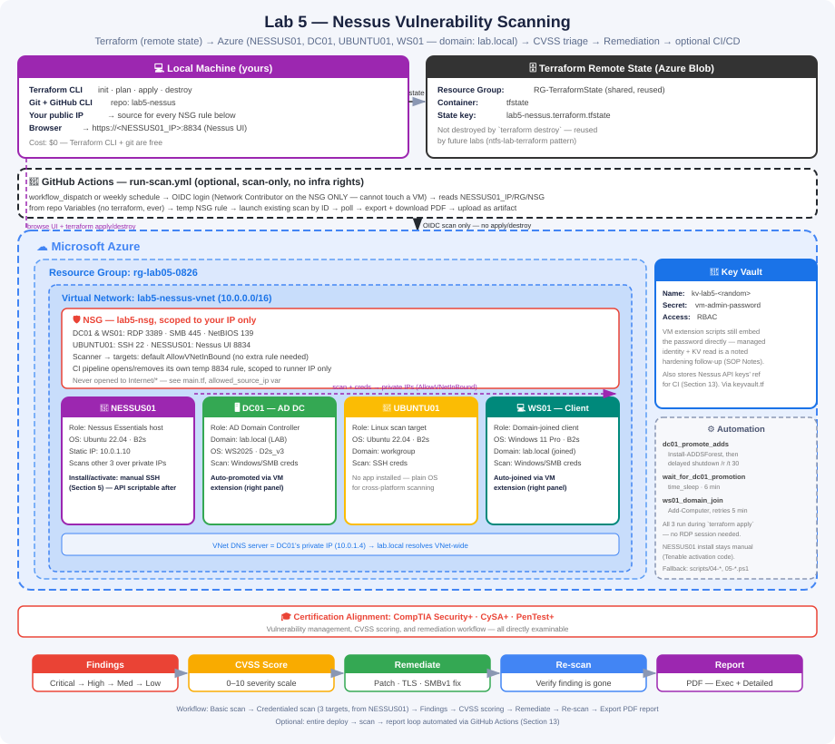

# Lab 5 — Nessus Vulnerability Scanning

## Overview

This lab provisions four VMs in Azure with Terraform against a remote state backend — three scan targets and a dedicated Nessus scanner VM — then automatically promotes one target to a real Active Directory domain controller and domain-joins a workstation to it, both run unattended as VM extensions during `terraform apply`. Nessus Essentials is installed and activated on its own VM (`NESSUS01`) rather than the local machine, so the full vulnerability management lifecycle — unauthenticated discovery scan, authenticated credentialed scan (Windows + Linux), CVSS-based severity triage, remediation of a real finding, re-scan verification, and PDF report export — can also be run unattended through an optional GitHub Actions CI/CD pipeline.

**Tool:** Nessus Essentials (free, permanently, up to 5 IPs) — the most widely deployed vulnerability scanner in the industry
**Infrastructure:** Terraform (remote state in Azure Blob Storage) provisioning DC01 (AD DC), UBUNTU01 (Linux target), WS01 (domain-joined workstation), and NESSUS01 (scanner)
**Platform:** Microsoft Azure (all four VMs) · optional GitHub Actions CI/CD pipeline
**Certification alignment:** CompTIA Security+ · CySA+ · PenTest+

---

## Business Context

Every network has vulnerabilities. The question isn't whether they exist — it's whether you find them before an attacker does. Vulnerability management is the systematic process of finding, classifying, prioritizing, and remediating security weaknesses before they're exploited.

Security teams run Nessus (or a tool built on the same principles) on a recurring schedule across their infrastructure, produce reports for management and compliance, and track whether remediation work is actually reducing risk over time. The scan-find-remediate-verify loop built in this lab is the same loop security engineers run in production, just at larger scale with more automation around it. Provisioning the scan targets and scanner with Terraform against a remote state backend — rather than one-off CLI commands or a scanner installed on someone's laptop — mirrors how that infrastructure is actually managed: version-controlled, reproducible, and safe for more than one person (or a CI pipeline) to run. Running the scan through GitHub Actions with OIDC federated authentication (no stored cloud credentials) mirrors how mature security teams schedule recurring scans without a human kicking them off by hand.

| Role | How this lab applies |
|---|---|
| Vulnerability Analyst | Running regular scans, triaging findings, tracking remediation — the core of the role |
| Security Engineer | Understanding CVSS scoring and remediation priority to guide infrastructure decisions |
| SOC Analyst | Vulnerability data informs investigation priority — a machine with known CVEs is higher risk if it appears in an alert |
| Cloud Security Engineer | Nessus builds the conceptual foundation for native cloud scanners (Microsoft Defender for Cloud, AWS Inspector); Terraform is the IaC skill that provisions what those scanners protect |
| DevSecOps / Platform Engineer | Orchestrating a security scan through a CI/CD pipeline with federated, credential-free cloud auth is a direct real-world pattern |

---

## Prerequisites

- Azure subscription with permissions to create Resource Groups, VMs, VNets, NSGs, Storage Accounts, and Key Vaults
- Terraform installed locally (`terraform version`, 1.5.0+)
- Azure CLI installed locally (`az --version`) and authenticated (`az account show`)
- GitHub CLI installed locally (`gh --version`) and authenticated (`gh auth status`)
- Free Tenable account (email only, no credit card) for the Nessus Essentials activation code
- A remote state backend (`RG-TerraformState` + storage account) — Section 2 of the SOP covers one-time setup, or reuse an existing one from another Terraform lab
- *(Optional, for Section 13 / CI-CD)* A GitHub repo with Actions enabled, and permissions to create an Azure AD App Registration for OIDC

---

## Architecture



**Data flow:** GitHub Actions (optional) or you directly → NESSUS01 (`https://<public-ip>:8834`) → scan traffic + Windows/SSH credentials over private IPs → DC01, UBUNTU01, WS01 (same VNet) → findings scored by CVSS → remediation applied → re-scan verifies the fix → PDF report exported (downloaded manually, or uploaded as a pipeline artifact).

| Resource | Name | Detail |
|---|---|---|
| Resource Group | `rg-lab05-0826` | Contains all lab resources |
| Domain Controller | `DC01` | Windows Server 2025, Standard_D2s_v3 — promoted to AD DC for `lab.local` |
| Linux Target | `UBUNTU01` | Ubuntu 22.04 LTS, Standard_B2s — no app installed, pure scan target |
| Workstation | `WS01` | Windows 11 Pro, Standard_B2s — domain-joined to `lab.local` |
| Scanner | `NESSUS01` | Ubuntu 22.04 LTS, Standard_B2s — hosts Nessus Essentials, in-VNet so CI runners can reach it |
| Virtual Network | `lab5-nessus-vnet` | 10.0.0.0/16 · DNS pre-pointed at DC01 (10.0.1.4) |
| NSG | `lab5-nsg` | RDP (3389), SSH (22), SMB (445), NetBIOS (139), Nessus UI (8834) — all scoped to your IP; CI adds/removes its own temporary 8834 rule |
| Terraform State | Azure Blob Storage, `RG-TerraformState` | Remote state, reusable across labs |
| CI (always on) | GitHub Actions | `terraform-checks.yml` — fmt/validate + `tfsec` on every push/PR, no Azure credentials, no setup |
| Scan pipeline (optional) | GitHub Actions | `run-scan.yml` — launches an existing scan, polls, exports report. Scoped to Network Contributor on the NSG only; never provisions or destroys infra |

> **What gets installed where:** NESSUS01 runs Nessus Essentials — scanner, policies, and console — installed manually once via SSH (Tenable requires a per-account activation code, so this step can't be scripted). It's hosted in Azure instead of on your local machine specifically so a GitHub Actions runner can reach it. DC01 gets AD DS (to become a real domain controller) and WS01 gets domain-joined, both automatically via VM extensions defined in `main.tf` and run as part of `terraform apply` — see Steps 3 and 4, which are verification-only. GitHub Actions (optional, Step 13) can launch a scan, poll for completion, and download the report entirely unattended once the scan itself has been configured once through the UI.

---

## Steps

### 1. Initialize the Project Repository

```powershell
cd C:\Users\828co\OneDrive\Documents\Repos
mkdir lab5-nessus
cd lab5-nessus
git init
echo "# Lab 5 — Nessus Vulnerability Scanning" > README.md
mkdir scripts, screenshots
git add .
git commit -m "initial commit: lab5-nessus project structure"
gh repo create lab5-nessus --public --source=. --remote=origin --push
```

---

### 2. Deploy Infrastructure with Terraform (Remote State)

One-time backend bootstrap (skip if you already have `RG-TerraformState` from another Terraform lab):

```powershell
az group create --name RG-TerraformState --location "Central US"
az storage account create --name <YOUR_STORAGE_ACCOUNT_NAME> --resource-group RG-TerraformState --sku Standard_LRS --encryption-services blob
az storage container create --name tfstate --account-name <YOUR_STORAGE_ACCOUNT_NAME>
```

Edit `backend.tf` with your storage account name. Then copy the vars template and set your IP:

```powershell
cp terraform.tfvars.example terraform.tfvars
# edit terraform.tfvars — set allowed_source_ip to your own IP (curl ifconfig.me)
```

```powershell
terraform init
terraform plan
terraform apply
terraform output
```

`terraform.tfvars` is gitignored (only the `.example` template is committed). Notice there's no password to set beforehand, not even as an environment variable — Terraform generates the VM admin/SSH password itself (`random_password.admin`) and stores it in Key Vault. Retrieve it whenever you actually need to log in:

```powershell
az keyvault secret show --vault-name <key_vault_name from terraform output> --name vm-admin-password --query value -o tsv
```

This provisions all four VMs, the VNet, NSG, and a Key Vault holding the generated admin password, then automatically promotes DC01 to a domain controller for `lab.local` and domain-joins WS01 to it — both run as VM extensions with no RDP session required. Total time is roughly 20–25 minutes. Save the public IPs from `terraform output` — you'll RDP/SSH with those, but scans themselves target private IPs (see Step 7).

> **Only scan systems you own.** Every NSG rule in `main.tf` is scoped to your IP only — Nessus traffic looks identical to an attack probe to anything monitoring in between.


---

### 3. Verify DC01's Domain Controller Promotion

Promotion already happened automatically during `terraform apply` (see `dc01_promote_adds` in `main.tf`). Confirm it succeeded:

```powershell
az vm extension list --resource-group rg-lab05-0826 --vm-name DC01 -o table
```

Then RDP in and check:

```powershell
Get-ADDomain
```

Should return `lab.local`. If the extension shows Failed/TimedOut, fall back to [`scripts/04-promote-dc01-domain-controller.ps1`](scripts/04-promote-dc01-domain-controller.ps1) via RDP — see the SOP's Troubleshooting section.


---

### 4. Verify WS01's Domain Join

Also automatic — the `ws01_domain_join` extension waits for DC01's reboot, then retries the join for up to 5 minutes. Confirm:

```powershell
az vm extension list --resource-group rg-lab05-0826 --vm-name WS01 -o table
(Get-CimInstance Win32_ComputerSystem).Domain    # run this one on WS01 via RDP
```

Should return `lab.local`. Fallback: [`scripts/05-domain-join-ws01.ps1`](scripts/05-domain-join-ws01.ps1).


---

### 5. Install Nessus Essentials on NESSUS01

Register at [tenable.com/products/nessus/nessus-essentials](https://tenable.com/products/nessus/nessus-essentials) for a free activation code. SSH into NESSUS01 using its public IP, download and install the `.deb` package, then start and enable the service:

```bash
ssh labadmin@<NESSUS01_PUBLIC_IP>
wget https://www.tenable.com/downloads/... -O Nessus.deb
sudo dpkg -i Nessus.deb
sudo systemctl start nessusd
sudo systemctl enable nessusd
```

Browse to `https://<NESSUS01_PUBLIC_IP>:8834`, accept the self-signed cert warning, select **Nessus Essentials**, enter the activation code, and create an admin account. Wait 10–20 minutes for the initial plugin download. Once activated, generate an API key under **My Account → API Keys** — you'll need it in Step 13 if you set up the CI pipeline.


---

### 6. Prepare All Three Targets for Credentialed Scanning

On DC01 and WS01 (via RDP, run on each):

```powershell
Set-Service -Name RemoteRegistry -StartupType Automatic
Start-Service RemoteRegistry
netsh advfirewall firewall add rule name='Nessus' dir=in action=allow protocol=tcp localport=445
```

On UBUNTU01 (via SSH) — no extra service needed, Terraform already enabled password auth:

```bash
ssh labadmin@<UBUNTU01_PUBLIC_IP>
sudo apt update && sudo apt list --upgradable
```

Full script: [`scripts/02-prep-target-for-scanning.ps1`](scripts/02-prep-target-for-scanning.ps1)


---

### 7. Run a Basic Discovery Scan

From NESSUS01's web UI (`https://<NESSUS01_PUBLIC_IP>:8834`): **New Scan → Basic Network Scan**, name it `Lab Network Discovery`, target the three targets' **private** IPs (comma-separated — not public), save, and launch. No credentials needed — this is what an internal, unauthenticated probe could see.

> **Why private IPs, not public?** NESSUS01 shares a VNet with DC01, UBUNTU01, and WS01, and Azure's default `AllowVNetInBound` NSG rule already permits all VM-to-VM traffic inside the same VNet — no extra rule was needed. Scanning over the private network is also more realistic: it's what an internal vulnerability scanner actually sees in production.


---

### 8. Run a Credentialed Scan

**New Scan → Basic Network Scan**, name it `Lab Network — Credentialed`, target the same three private IPs, then add **two** credential sets — both using the password retrieved from Key Vault (Step 2): **Windows/Password** (username `labadmin`, domain `LAB`) for DC01 and WS01, and **SSH/Password** (username `labadmin`) for UBUNTU01. Launch — 20–30 minutes.

Authenticated scans inspect each target from the inside and typically return **5–10x** more findings than the unauthenticated scan. Note the scan ID from the URL bar once it's created — you'll need it for `NESSUS_SCAN_ID` if you set up the CI pipeline in Step 13.


---

### 9. Interpret CVSS Severity and Findings

| Severity | CVSS Range | Typical example |
|---|---|---|
| Critical | 9.0–10.0 | EternalBlue (MS17-010) — remote code execution |
| High | 7.0–8.9 | Unpatched RDP vulnerability |
| Medium | 4.0–6.9 | SSL certificate expired or weak cipher |
| Low | 0.1–3.9 | Missing security headers on a web service |
| Info | 0 | Open port detected, OS version identified |

Each finding shows a Synopsis, Description, Solution, CVE, CVSS Score, Risk Factor, and the plugin output evidence.


---

### 10. Remediate a Finding and Re-Scan

Pick one Medium or High finding, apply its Solution (patch install, disable TLS 1.0/1.1, or disable SMBv1 on a Windows target — see [`scripts/03-remediate-findings.ps1`](scripts/03-remediate-findings.ps1); `apt upgrade` on UBUNTU01 for a cross-platform pair), then re-run the credentialed scan and confirm the finding no longer appears.


---

### 11. Export a Vulnerability Report

Open the completed credentialed scan → **Report → PDF** → choose **Executive Summary** (management-facing) or **Detailed Vulnerabilities** (remediation tracking) → **Generate Report**.


---

### 12. Commit and Push to GitHub

```powershell
cd C:\Users\828co\OneDrive\Documents\Repos\lab5-nessus
git add .
git commit -m "feat: nessus lab5 — terraform remote-state infra, real AD promotion, VM-hosted scanner, cvss triage, remediation, verified re-scan, pdf report, ci/cd pipeline"
git push
```

---

### 13. (Optional) Automate the Scan with a GitHub Actions Pipeline

This pipeline only ever *operates a scan* — it never provisions or destroys infrastructure. That's deliberate: it mirrors how a real security team's pipeline usually works against infrastructure it doesn't own, with permissions narrow enough that it couldn't touch a VM even if it tried. Infra lifecycle stays exactly as in Steps 1–12: local `terraform apply`/`destroy`, run by hand. Once the scan is configured once through the UI (Steps 7–8), the pipeline just launches that scan by ID, polls until it completes, and downloads the report — unattended, on a schedule or on demand.

**One-time setup:**
1. Create an Azure AD App Registration with a federated credential trusting your GitHub repo's OIDC issuer (no stored client secret), and grant it **Network Contributor scoped to just the NSG** (not Contributor on the subscription — the pipeline should be provably incapable of creating/deleting VMs) — see `SOP_Lab5_Nessus_Vulnerability_Scanning.md`, Section 13.1, for the exact `az` commands.
2. Add repo **Secrets**: `NESSUS_ACCESS_KEY`, `NESSUS_SECRET_KEY`.
3. Add repo **Variables**: `AZURE_CLIENT_ID`, `AZURE_TENANT_ID`, `AZURE_SUBSCRIPTION_ID`, `NESSUS01_IP`, `RESOURCE_GROUP`, `NSG_NAME`, `NESSUS_SCAN_ID`. The last three are copied once from `terraform output` after you deploy — the pipeline reads them as plain Variables rather than querying Terraform state live, so it never needs access to the state backend either.

**Run it:** Actions tab → **Run Nessus Scan** → **Run workflow** for an on-demand run, or let it run itself — it's also scheduled for every Monday at 06:00 UTC (edit or remove the `cron` line in `run-scan.yml` to change that). The pipeline opens a temporary, self-cleaning NSG rule scoped to the runner's IP (port 8834 only — your own access rule is untouched), waits for Nessus to respond, launches the scan, polls for completion, exports a PDF, and uploads it as a build artifact, then removes the temporary rule. If you redeploy the infrastructure later, update the `NESSUS01_IP`/`RESOURCE_GROUP`/`NSG_NAME` Variables to match before running it again.


---

## Key Skills Demonstrated

- Infrastructure as Code with Terraform — remote state in Azure Blob Storage, Key Vault-native secret generation (`random_password` + Key Vault as the source of truth, not a human-typed value), multi-VM provisioning (Windows + Linux)
- Static security analysis in CI (`tfsec`) catching misconfigurations before `apply` ever runs, with zero Azure credentials required for the check itself
- Unattended post-deploy configuration via Azure VM extensions — AD DS promotion and domain join both run automatically during `terraform apply`, including handling the mid-script-reboot problem and adding retry logic for timing-sensitive steps
- Active Directory domain controller promotion (`Install-ADDSForest`) and domain join, with VNet DNS pre-wired for it via Terraform
- Nessus Essentials deployment and activation, hosted on its own VM for CI/CD reachability
- Unauthenticated (basic) network discovery scanning across multiple hosts
- Credentialed scanning — Windows (SMB) and Linux (SSH) authentication in a single scan
- CVSS severity interpretation and finding triage (Critical → Info)
- Remediation of real findings — Windows Update, TLS protocol hardening, SMBv1 disablement, Linux patch management
- Remediation verification via re-scan — the loop that vulnerability management programmes run continuously
- Executive vs. detailed vulnerability reporting for different audiences
- CI/CD pipeline orchestration with GitHub Actions — OIDC federated authentication to Azure (no stored cloud credentials), dynamic least-privilege NSG rules, polling async operations, artifact delivery
- Git version control and GitHub portfolio management via CLI

---

## Cleanup

```powershell
terraform destroy
```

Destroy is always local and manual, by design — the scan pipeline (Step 13) is scoped so it can only run scans, never touch infrastructure, so there's no Actions equivalent for this step. Nothing to set beforehand for the password either; `random_password.admin` is just another resource Terraform tracks and destroys like any other.

This removes all four VMs (including NESSUS01), the VNet, NSG, and Key Vault. The remote state backend (`RG-TerraformState`) is intentionally left in place — it's reusable for future Terraform labs. This is the last lab in the series — nothing here needs to stay running afterward.
